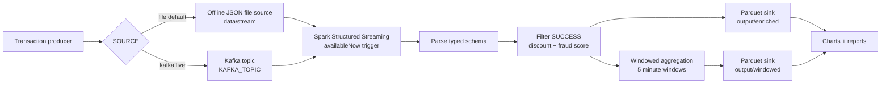
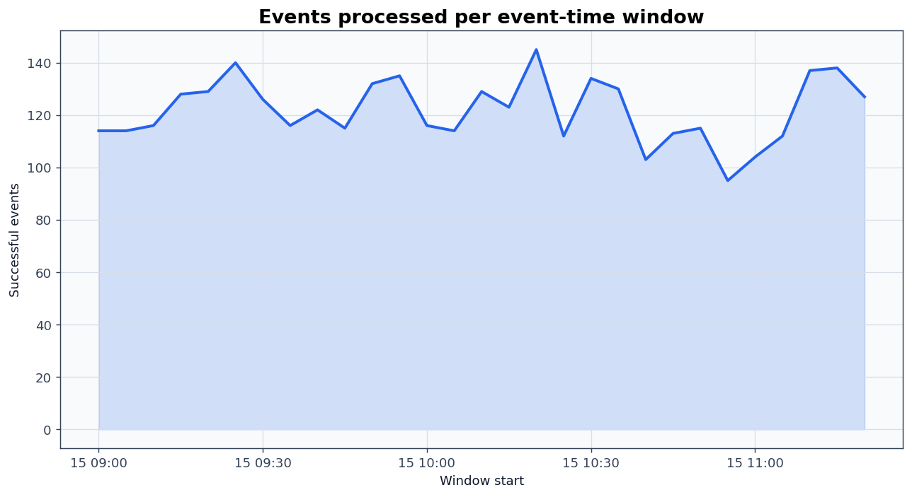
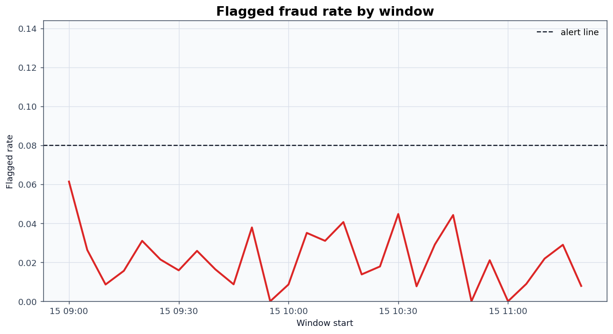
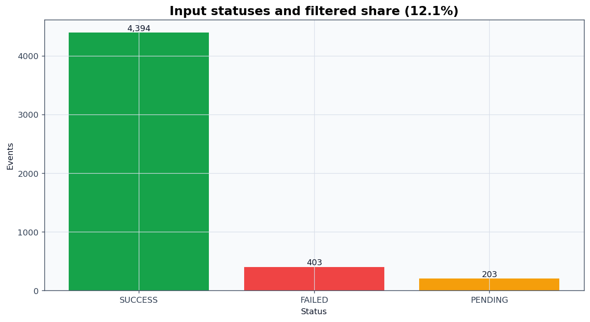
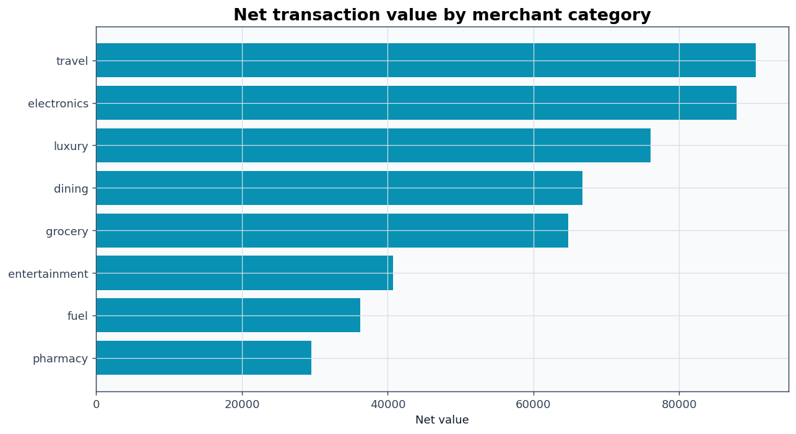
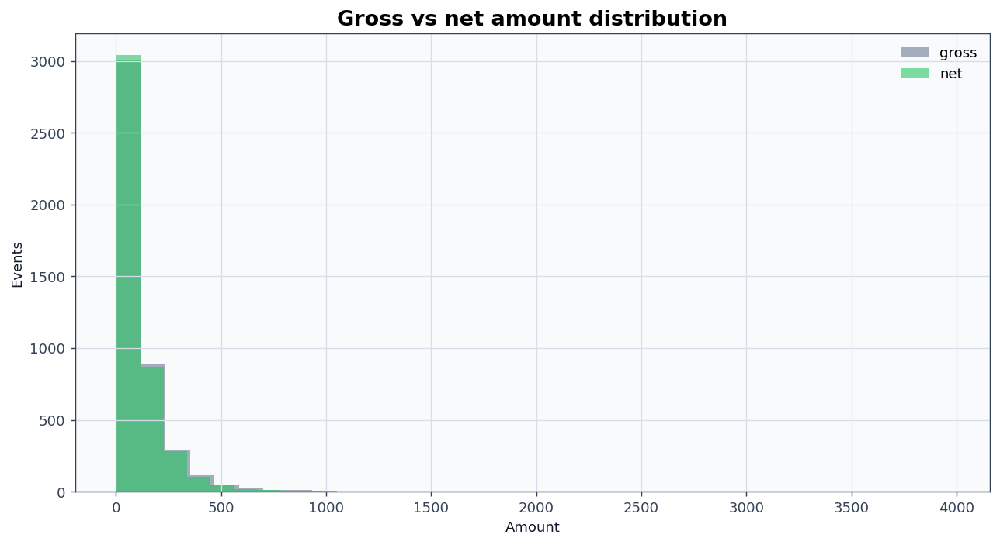
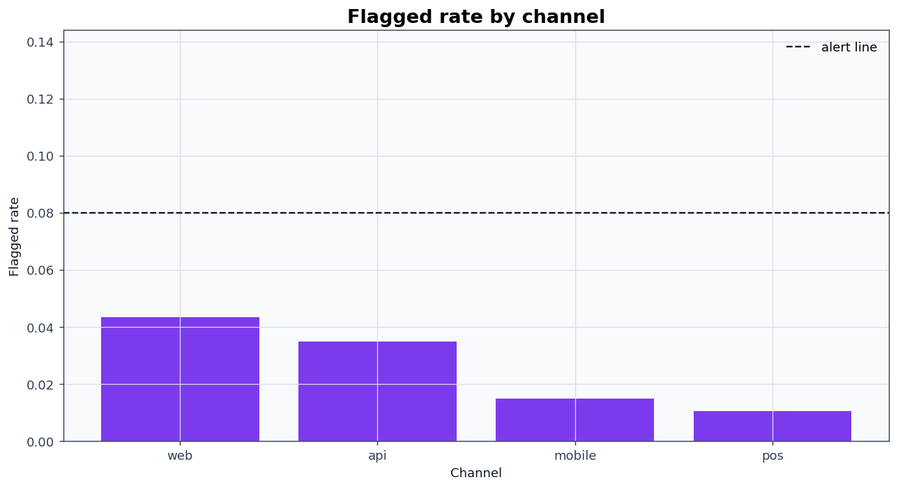

# Spark Kafka Transaction Processor


A runnable transaction streaming demo that keeps the Kafka architecture but runs end to end offline. The default `SOURCE=file` path writes JSON transaction batches to `data/stream/`, ingests them with PySpark Structured Streaming, enriches successful transactions, writes Parquet sinks, and generates charts plus reports.



## What It Produces

Latest offline run: `5,000` generated events, `4,394` enriched events, `606` filtered non-success events, `29` aggregate windows, `102` flagged transactions, `2.32%` flagged rate, and `105.74` enriched events/sec on the local run.








Sample enriched events:

| transaction_id | event_time          | merchant_category | channel | gross_amount | discount_rate | net_amount | fraud_score | is_flagged |
| -------------- | ------------------- | ----------------- | ------- | ------------ | ------------- | ---------- | ----------- | ---------- |
| txn_42_0000000 | 2026-01-15 09:00:05 | grocery           | web     | 100.05       | 0.0300        | 97.05      | 0.2300      | False      |
| txn_42_0000002 | 2026-01-15 09:00:11 | luxury            | mobile  | 356.88       | 0.0400        | 342.60     | 0.2800      | False      |
| txn_42_0000003 | 2026-01-15 09:00:13 | pharmacy          | mobile  | 12.45        | 0.0200        | 12.20      | 0.1650      | False      |
| txn_42_0000004 | 2026-01-15 09:00:13 | travel            | web     | 117.49       | 0.0500        | 111.62     | 0.1750      | False      |
| txn_42_0000005 | 2026-01-15 09:00:16 | grocery           | pos     | 61.76        | 0.0300        | 59.91      | 0.1100      | False      |
| txn_42_0000006 | 2026-01-15 09:00:16 | luxury            | api     | 258.37       | 0.0400        | 248.04     | 0.3450      | False      |
| txn_42_0000007 | 2026-01-15 09:00:17 | luxury            | pos     | 79.46        | 0.0400        | 76.28      | 0.2000      | False      |
| txn_42_0000008 | 2026-01-15 09:00:17 | dining            | web     | 13.68        | 0.1000        | 12.31      | 0.2300      | False      |

Windowed aggregates:

| window_start        | window_end          | event_count | gross_value | net_value | flagged_count | fraud_rate |
| ------------------- | ------------------- | ----------- | ----------- | --------- | ------------- | ---------- |
| 2026-01-15 09:00:00 | 2026-01-15 09:05:00 | 114         | 12,262.37   | 11,665.01 | 7             | 0.0614     |
| 2026-01-15 09:05:00 | 2026-01-15 09:10:00 | 114         | 12,582.25   | 11,873.91 | 3             | 0.0263     |
| 2026-01-15 09:10:00 | 2026-01-15 09:15:00 | 116         | 12,354.15   | 11,700.54 | 1             | 0.0086     |
| 2026-01-15 09:15:00 | 2026-01-15 09:20:00 | 128         | 13,230.41   | 12,584.89 | 2             | 0.0156     |
| 2026-01-15 09:20:00 | 2026-01-15 09:25:00 | 129         | 15,813.26   | 15,006.55 | 4             | 0.0310     |
| 2026-01-15 09:25:00 | 2026-01-15 09:30:00 | 140         | 15,377.74   | 14,567.10 | 3             | 0.0214     |
| 2026-01-15 09:30:00 | 2026-01-15 09:35:00 | 126         | 13,113.81   | 12,380.72 | 2             | 0.0159     |
| 2026-01-15 09:35:00 | 2026-01-15 09:40:00 | 116         | 14,601.02   | 13,839.01 | 3             | 0.0259     |
| 2026-01-15 09:40:00 | 2026-01-15 09:45:00 | 122         | 14,883.36   | 14,054.49 | 2             | 0.0164     |
| 2026-01-15 09:45:00 | 2026-01-15 09:50:00 | 115         | 15,579.75   | 14,810.59 | 1             | 0.0087     |
| 2026-01-15 09:50:00 | 2026-01-15 09:55:00 | 132         | 19,896.99   | 18,781.93 | 5             | 0.0379     |
| 2026-01-15 09:55:00 | 2026-01-15 10:00:00 | 135         | 15,347.88   | 14,473.62 | 0             | 0.0000     |

## Architecture

This repository keeps both implementations:

- Scala reference: `src/main/scala/com/example/streaming/TransactionProcessor.scala`
- Runnable PySpark app: `python/`

The Python app is the runnable path. `python/skproc/source.py` owns the typed source contract and the `SOURCE` gate. The default source is an offline streaming file source, which lets the full Structured Streaming job run without Kafka, without network package resolution, and without a broker. The Kafka path is real code but only selected when `SOURCE=kafka`.

Outputs are written to:

- `output/enriched/` for successful, enriched transaction events
- `output/windowed/` for event-time window aggregates
- `reports/figures/` for the six PNG charts
- `reports/pipeline_report.md`, `reports/metrics.json`, and `reports/run_manifest.json`

## How It Works

The generator writes newline-delimited JSON batches to `data/stream/`, emulating Kafka partitions and offsets with an append-only directory. Spark reads those files through Structured Streaming using the fixed transaction schema from `python/skproc/source.py`.

The transform keeps `SUCCESS` transactions, applies category discount rules, computes `net_amount = amount * (1 - discount_rate)`, and adds a bounded fraud score from amount, category, channel, country, and the injected latent signal. Rows at or above the configured threshold become `is_flagged=true`.

The aggregate path uses 5-minute event-time windows with a 30-minute watermark and emits per-window event count, gross value, net value, flagged count, and fraud rate. Both streaming sinks use `.trigger(availableNow=True)` followed by `awaitTermination()`, so the pipeline processes currently available data and exits cleanly instead of hanging.

File sinks and checkpoint directories give Spark replay protection for each query. In the offline run, output files are regenerated from a clean checkpoint directory by the orchestrator.

## Quickstart

Use the specified interpreter:

```bash
/opt/anaconda3/bin/python3 -m pip install -r python/requirements.txt
/opt/anaconda3/bin/python3 python/run_pipeline.py --events 5000
/opt/anaconda3/bin/python3 -m pytest -q python/tests
```

Or use Make:

```bash
make setup
make run
make test
```

Spark is configured with `master("local[*]")`, `spark.ui.enabled=false`, `spark.sql.shuffle.partitions=8`, and log level `ERROR`. The app does not set `JAVA_HOME`; it uses the Java on `PATH`.

## Going Live With Kafka

Offline mode is the default:

```bash
SOURCE=file /opt/anaconda3/bin/python3 python/run_pipeline.py --events 5000
```

Live mode switches only the source:

```bash
SOURCE=kafka \
KAFKA_BOOTSTRAP=localhost:9092 \
KAFKA_TOPIC=transactions \
/opt/anaconda3/bin/python3 python/run_pipeline.py --events 5000
```

For live Kafka, submit Spark with the Kafka SQL connector already available in the runtime environment. The offline demo intentionally does not use `--packages` or fetch `spark-sql-kafka` at runtime.
